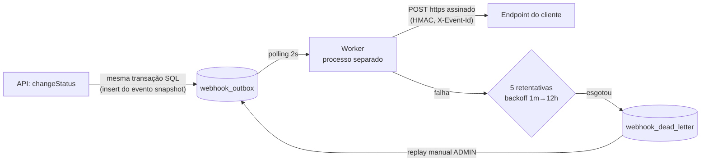

# RFC: Sistema de Webhooks de Notificação de Pedidos

## Metadados

| Campo | Valor |
| --- | --- |
| Autor | Viviane Pereira |
| Status | Em revisão |
| Data | 2026-07-19 |
| Revisores | Larissa (Tech Lead), Marcos (PM), Bruno (Eng. Pleno), Diego (Eng. Sênior), Sofia (Eng. Segurança) |

## Resumo executivo (TL;DR)

Propomos notificar clientes B2B sobre mudanças de status de pedidos por meio de webhooks HTTP assinados. A publicação usa o **padrão outbox sobre o MySQL existente**: o evento é gravado na mesma transação que muda o status do pedido, e um **worker em processo separado** lê a tabela por polling de 2 segundos e entrega com **retry exponencial (5 retentativas) e DLQ**. A segurança é por **HMAC-SHA256 com secret por endpoint** (rotação com grace period de 24 h) e a semântica de entrega é **at-least-once com deduplicação por `X-Event-Id`**. Nenhuma infraestrutura nova é adicionada; o módulo reusa integralmente os padrões do projeto.

## Contexto e problema

Três clientes B2B — Atlas Comercial, MaxDistribuição e Nova Cargo — pediram formalmente para ser notificados em tempo real quando o status dos seus pedidos muda. Hoje eles fazem polling no `GET /orders`, o que torna a integração lenta e cara; a Atlas sinalizou risco de migração para um concorrente se a entrega não sair até o fim do trimestre (`[09:00] Marcos`). Para esses clientes, "tempo real" é qualquer entrega abaixo de 10 segundos (`[09:02] Marcos`). O escopo é somente outbound: a plataforma envia, os clientes recebem (`[09:02] Marcos`).

Do lado técnico, a restrição central é a transação de mudança de status (`changeStatus` em `src/modules/orders/order.service.ts`), que já atualiza `orders`, insere em `order_status_history` e ajusta estoque (`[09:04] Bruno`). Qualquer solução precisa satisfazer duas forças simultâneas:

1. **Não acoplar** a disponibilidade/latência do endpoint do cliente à transação de status (`[09:04] Bruno`);
2. **Não perder eventos**: status mudou ⇔ notificação registrada, sem inconsistência (`[09:06] Diego`, `[09:41] Diego`).

## Proposta técnica

A solução tem quatro blocos, cada um formalizado em ADR:

- **Publicação transacional (outbox)** — [ADR-001](adrs/ADR-001-outbox-no-mysql.md): a mudança de status insere o evento na tabela `webhook_outbox` dentro da mesma transação SQL que já existe no `changeStatus`. Commit registra o evento; rollback o descarta junto. O filtro de status assinados pelo cliente é aplicado na inserção, e o payload é gravado já renderizado — snapshot do estado no momento da transição ([ADR-007](adrs/ADR-007-snapshot-payload-na-insercao.md)).
- **Entrega assíncrona (worker)** — [ADR-002](adrs/ADR-002-worker-separado-polling.md): um processo Node separado da API, na mesma stack e banco, lê os eventos pendentes por polling a cada 2 segundos e faz o HTTP POST com timeout de 10 segundos (`[09:42] Diego`). Single-worker por ora; ordering garantida apenas por `order_id`, limitação documentada (`[09:13] Larissa`).
- **Resiliência (retry + DLQ)** — [ADR-003](adrs/ADR-003-retry-backoff-dlq.md): após a falha do envio inicial, até 5 retentativas com backoff 1m/5m/30m/2h/12h (~15 h entre a primeira falha e a última tentativa; semântica desambiguada no ADR); esgotadas, o evento vai para a tabela `webhook_dead_letter` e só volta por replay manual de um ADMIN, com auditoria. A semântica resultante é at-least-once, com `X-Event-Id` para dedup no cliente ([ADR-005](adrs/ADR-005-at-least-once-x-event-id.md)).
- **Segurança** — [ADR-004](adrs/ADR-004-hmac-sha256-secret-por-endpoint.md): payload assinado com HMAC-SHA256 e secret única por endpoint, rotacionável via API com 24 h de validade paralela. URLs obrigatoriamente `https` e payload limitado a 64KB, com erro acima disso (`[09:23] Sofia`, `[09:24] Larissa`).

Completam a proposta os endpoints de configuração: CRUD autenticado de webhooks por customer (com a secret gerada pela plataforma e devolvida na criação, `[09:31] Marcos`), consulta de histórico de entregas (`[09:34] Marcos`) e o replay admin de DLQ. Tudo como um novo módulo no padrão existente da codebase — AppError com códigos `WEBHOOK_*`, Pino, error middleware e `requireRole` inalterados ([ADR-006](adrs/ADR-006-reuso-padroes-existentes.md)).

**O que muda no sistema existente:** uma única alteração pontual no `changeStatus` (a chamada de publicação do evento recebendo o client da transação, `[09:41] Bruno`), o registro do novo router no agregador de rotas (`src/routes/index.ts`) e quatro tabelas novas no schema Prisma (configuração, outbox, DLQ e histórico de entregas). O restante é código novo, isolado no módulo. Contratos HTTP, formato do payload, matriz de erros e fluxos detalhados estão no [FDD](FDD.md).

## Alternativas consideradas

| Alternativa | Trade-off que motivou o descarte | Registro |
| --- | --- | --- |
| Disparo síncrono dentro do service de orders | Cliente lento travaria mudanças de status; cliente fora do ar não tem tratamento possível (rollback do status é inaceitável) (`[09:04] Bruno`, `[09:06] Diego`) | [ADR-001](adrs/ADR-001-outbox-no-mysql.md) |
| Redis Streams / fila dedicada | Infraestrutura nova para um time pequeno — "overengineering"; perderia a atomicidade com a transação SQL (`[09:07] Diego`) | [ADR-001](adrs/ADR-001-outbox-no-mysql.md) |
| Trigger de banco para acionar o worker | Trigger MySQL não notifica processo externo, só executa SQL; o improviso "fica esquisito", e polling de 2 s já atende o requisito de < 10 s (`[09:09] Diego`) | [ADR-002](adrs/ADR-002-worker-separado-polling.md) |
| Retry indefinido ou teto de 3 tentativas | Indefinido deixa evento pendurado para sempre (`[09:15] Diego`); 3 tentativas morrem em ~30 min e não cobrem indisponibilidade real de 2 h (`[09:16] Diego`) | [ADR-003](adrs/ADR-003-retry-backoff-dlq.md) |
| Secret global da plataforma | "Se vaza uma, vaza tudo" — secret por endpoint contém o blast radius (`[09:21] Sofia`) | [ADR-004](adrs/ADR-004-hmac-sha256-secret-por-endpoint.md) |
| Garantia exactly-once | Exigiria coordenação dos dois lados da integração; at-least-once com event_id "resolve 99% dos casos" (`[09:25] Diego`) | [ADR-005](adrs/ADR-005-at-least-once-x-event-id.md) |

## Questões em aberto

Pontos levantados na reunião e **não** decididos — permanecem abertos, sem decisão neste RFC:

1. **Rate limiting de envio por cliente** — se um cliente tem 50 pedidos mudando de status em um minuto, ele recebe 50 chamadas. Ficou como "observar e decidir depois" (`[09:38] Diego`, `[09:39] Larissa`).
2. **Escala para múltiplos workers** — particionamento por `order_id` ou lock pessimista foram citados como caminhos, mas "é problema do futuro"; com múltiplos workers a garantia de ordering se perde (`[09:13] Diego`).
3. **Aviso proativo ao cliente sobre webhook com falhas** (ex.: email após 3 falhas seguidas) — fora de escopo desta fase; "talvez próxima fase, depois que a gente medir o impacto" (`[09:37] Larissa`).
4. **Arquivamento das linhas entregues da outbox** — a ideia de arquivar após ~30 dias foi mencionada, mas explicitamente deixada fora do escopo da feature (`[09:08] Diego`).
5. **Endurecimento das roles do CRUD de configuração** — hoje qualquer role autenticada; "mais pra frente a gente pode endurecer" (`[09:37] Sofia`).

## Impacto e riscos

**Impacto no sistema existente:** mínimo e localizado — um insert adicional na transação do `changeStatus`, quatro tabelas novas e um módulo novo; error middleware, logger e autenticação seguem intocados ([ADR-006](adrs/ADR-006-reuso-padroes-existentes.md)).

**Impacto operacional:** passa a existir um segundo processo para implantar, monitorar e manter vivo; se o worker cair, as entregas param (eventos acumulam na outbox, sem perda) até o processo voltar. O polling adiciona consultas constantes ao MySQL.

**Impacto no time:** estimativa de 3 sprints, já incluindo a revisão de segurança da Sofia — que pede ao menos 2 dias úteis para revisar HMAC e geração de secret antes do deploy (`[09:46] Larissa`, `[09:46] Sofia`). O prazo do cliente âncora (Atlas) é fim de novembro (`[09:45] Marcos`).

**Riscos de arquitetura:**

- Crescimento contínuo da `webhook_outbox` sem política de arquivamento definida (questão em aberto 4) pode degradar o polling com o tempo.
- A transação de status, já pesada (`[09:04] Bruno`), ganha mais uma escrita; qualquer lentidão na inserção do evento afeta a operação principal de pedidos.
- A eficácia da segurança depende de o cliente validar a assinatura e deduplicar por `X-Event-Id` — responsabilidades que ficam do lado dele (`[09:25] Sofia`), mitigadas por documentação destacada no portal (`[09:26] Marcos`).

## Decisões relacionadas

- [ADR-001 — Padrão Outbox no MySQL](adrs/ADR-001-outbox-no-mysql.md)
- [ADR-002 — Worker em processo separado com polling de 2 s](adrs/ADR-002-worker-separado-polling.md)
- [ADR-003 — Retry com backoff exponencial e DLQ](adrs/ADR-003-retry-backoff-dlq.md)
- [ADR-004 — HMAC-SHA256 com secret por endpoint](adrs/ADR-004-hmac-sha256-secret-por-endpoint.md)
- [ADR-005 — At-least-once com X-Event-Id](adrs/ADR-005-at-least-once-x-event-id.md)
- [ADR-006 — Reuso dos padrões existentes](adrs/ADR-006-reuso-padroes-existentes.md)
- [ADR-007 — Snapshot do payload na inserção](adrs/ADR-007-snapshot-payload-na-insercao.md)
